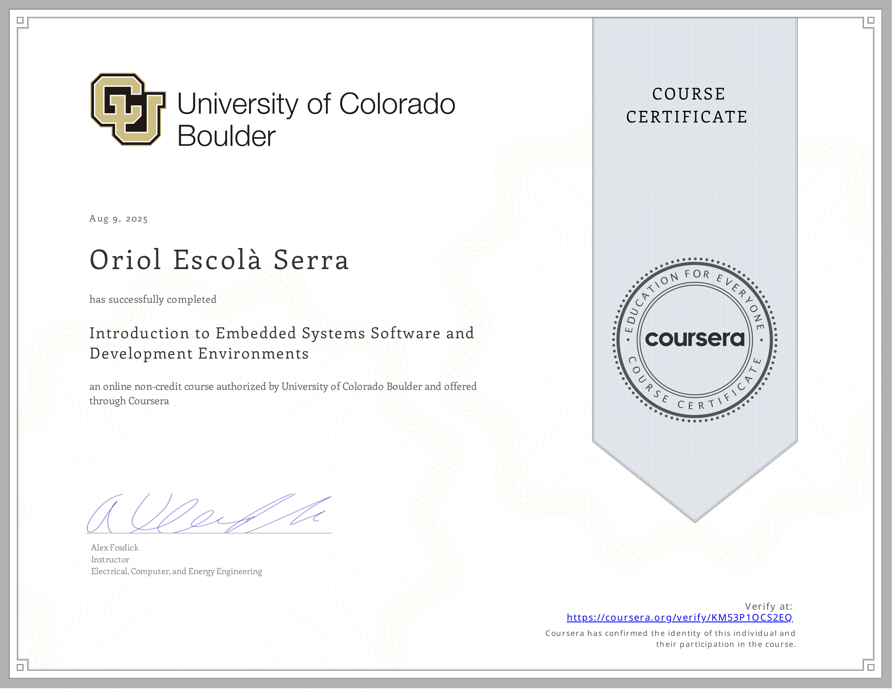

# Introduction to Embedded Systems Software and Development Environments  
**Coursera • University of Colorado Boulder**


This repository contains coursework and code developed during the Coursera course **"Introduction to Embedded Systems Software and Development Environments"** taught by Professor Alex Fosdick from the University of Colorado Boulder.  
[Course link →](https://www.coursera.org/learn/introduction-embedded-systems)

## Course Description

This intermediate-level course (~9 hours total) provides:

- Real-world coding experience and hands-on project work with ARM‑based microcontrollers.  
- Implementation of software configuration management and development of embedded software applications.  
- Creation of a build system using the GNU toolchain (GCC and GNU Make), along with Git version control in a Linux virtual machine environment.  
- Writing of C programs that define data in different memory regions.  
- A final project where students build their own build system and firmware capable of manipulating memory.  

The course consists of **4 modules**, including quizzes and peer-reviewed assignments.

## Repository Structure

```
├── module_1        # Embedded System Development Components
├── module_2        # Compilations with GCC and GNU Make
├── module_3        # Memory Types, Segments and Management
└── module_4        # Course 1 Final Assessment
```

## Certificate of Completion
<br/>

<div align="center">
    <a href="https://www.coursera.org/account/accomplishments/verify/KM53P1OCS2EQ">
        
    </a>
</div>


## Author

Created by **Oriol Escolà Serra** for educational purposes while completing the Coursera course.

## License

The starter code used in this project was created by Professor Alex Fosdick as part of the Coursera course mentioned above.

Original code © 2017 by Alex Fosdick – University of Colorado. Provided for educational purposes under permissive terms.
